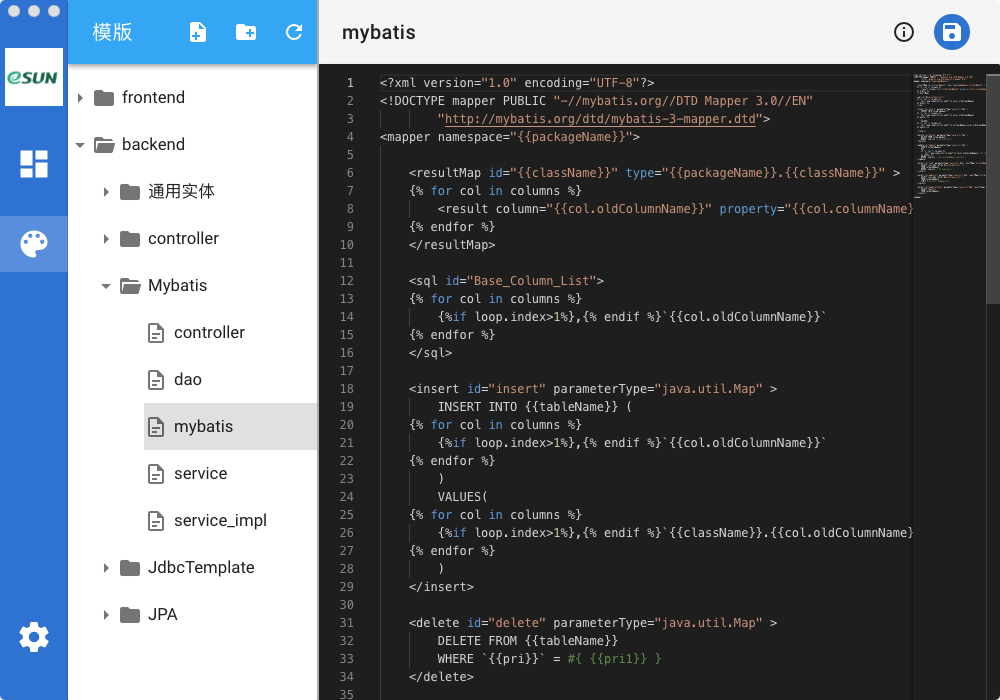
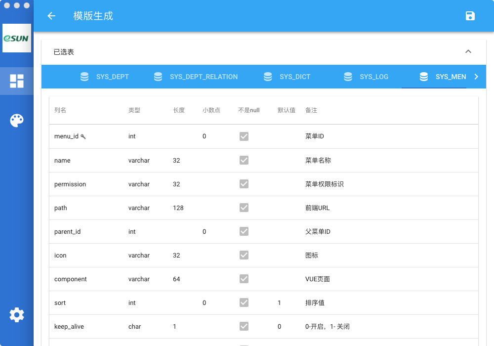

## 欢迎使用代码生成工具

一款从数据库逆向生成代码工具，开发该工具的初衷概念模型->逻辑模型->物理模型->生成代码，以释放双手为目的，各大模板也在陆续补充和优化。如有发现bug、建议和建议欢迎提交issue,谢谢！

支持win，macos欢迎[下载](https://github.com/eshun/pandora-doc/releases)

### 功能

- [x] 支持mysql库,其他数据库开发中
- [x] 支持生成JPA/JdbcTemplate/Mybatis代码
- [x] 支持生成vue element ui
- [x] 支持lombok
- [x] 支持swagger api
- [x] 支持模版编辑
- [ ] 一对多，多对多


### 模版编辑

工具提供可视化界面编辑模版，自定义模版。
```
{{packageName}}包名
{{author}}开发者
{{day}}当期日期
{{className}}类名

{{tableName}}表名
{{tableInfo}}表
{{pri}}表第一个主键

{{columns}}所有列
{{columnName}}列名
{{oldColumnName}}原列名
{{columnKey}}是否主键
{{isNull}}是否可为空
{{columnComment列备注
 ... 条件语句
{{column.columnName}}循环语句
```

### 部分界面





